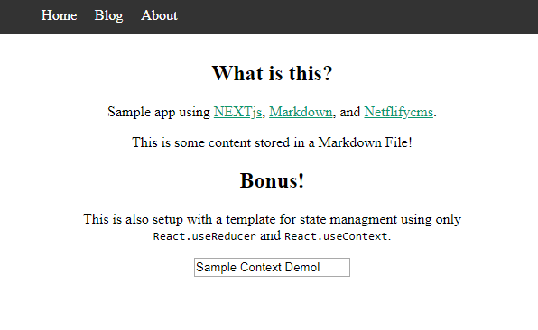

# NextJS Markdown Netlify Boilerplate

Simple, minimal boilerplate to get started with [Next.js](https://nextjs.org/) while maintaining content within Markdown and [Netlifycms](https://www.netlifycms.org/).

Also contains a template for state management using only `React.useReducer` and `React.useContext`.

> Status: In development

> This is an organized and modifyied version from [netlifycms-nextjs](https://github.com/masives/netlifycms-nextjs).

<div>
  <a href="https://facebook.github.io/react/"></a>
  <a href="https://nextjs.org/"></a>
  <a href="https://hmsk.github.io/frontmatter-markdown-loader/"></a>
  <a href="https://www.netlifycms.org/"></a>
</div>



## Install

Download or clone this repository and run

```
npm install
```

## Structure

Notes are on their way. For now read through the source code, it is pretty organized and well documented.

## Maintainers

- [Robert Todar](https://www.roberttodar.com/)
